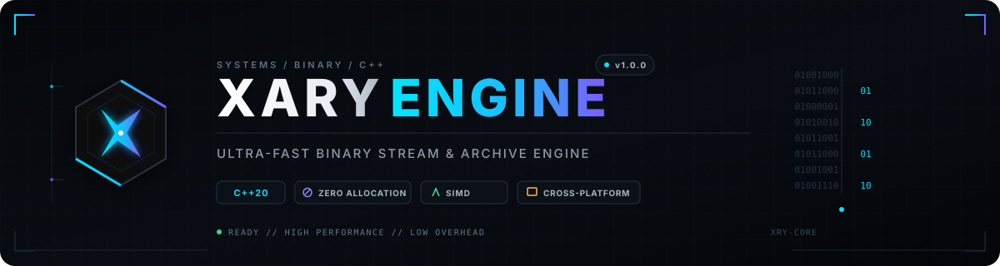

<div align="center">



<br /><br />

[](https://github.com/microsoft/winget-pkgs)
[](https://github.com/DeveloperXHarsh/scoop-xary)
[](https://github.com/DeveloperXHarsh/homebrew-xary)
[](https://en.cppreference.com/w/cpp/20)
[](https://cmake.org/)
[](LICENSE)

---

</div>

<h2 align="center">📦 Distribution & Installation</h2>

**Xary Engine** is distributed across major package managers and direct bootstrap scripts for immediate, zero-configuration deployment:

### 🪟 Windows Environments

**Via Direct Bootstrapper (Recommended for CI/CD):**
```powershell
# Native PowerShell execution (Requires RemoteSigned or unrestricted policy)
irm [https://raw.githubusercontent.com/DeveloperXHarsh/Xary/main/install.ps1](https://raw.githubusercontent.com/DeveloperXHarsh/Xary/main/install.ps1) | iex
```

**Via Package Managers:**
```bash
# Windows Package Manager (Winget)
winget install DeveloperXHarsh.Xary

# Scoop Package Manager
scoop bucket add xary [https://github.com/DeveloperXHarsh/scoop-xary](https://github.com/DeveloperXHarsh/scoop-xary)
scoop install xary
```

### 🍺 macOS & Linux Environments
```bash
# Homebrew Package Manager
brew tap DeveloperXHarsh/xary
brew install xary
```

---

<h2 align="center">📌 Engine Architecture & Overview</h2>

**Xary** is a low-level C++20 systems engineering tool and embedded library engineered for maximal deterministic performance in large-scale binary dataset manipulation, metadata-obfuscated archiving, and high-fidelity signature analysis.

Traditional I/O operations and naive `std::filesystem` implementations suffer from catastrophic memory fragmentation and paging bottlenecks when addressing multi-gigabyte structures. **Xary bypasses the OS virtual memory bottleneck.**

By strictly enforcing a vectorized, chunked **64 KB I/O stream pipeline**, Xary maintains an `O(1)` deterministic RAM footprint regardless of whether the target dataset is 10 Megabytes or 500 Gigabytes.

### Core Datapath Capabilities
1. **Recursive Archive Generation (`--pack`)**: Serialize complex directory trees into unified `.xary` binary containers via contiguous write streams.
2. **High-Entropy Obfuscation (`--sec`)**: Deploy a rolling XOR/rotation cipher schedule to scramble path strings, entry lengths, and header magic into indistinguishable binary noise (defeating static structural analysis).
3. **Deterministic Reconstruction (`--unpack`)**: Parse container layouts and rebuild original filesystem structures with exact topological accuracy.
4. **Heuristic File Inspection (`--inspect`)**: Bypass spoofed filesystem extensions by performing deep magic-byte signature pattern matching directly against the chunked buffer view.
5. **Stream Cryptography (`--encode` / `--decode`)**: Apply high-throughput, SIMD-accelerated linear transformations to raw byte streams using deterministic 32-bit key constraints.

---

<h2 align="center">🚀 Systems-Level Features</h2>

* **📦 O(1) Space Complexity**: Bounded 64 KB heap allocation eliminates dynamic memory spikes during mass I/O operations.
* **⚡ Vectorized Datapaths**: Cryptographic primitives leverage aggressive compiler unrolling (`#pragma GCC unroll 16`) to saturate ALU pipelines (AVX/NEON).
* **🔐 Full Container Obfuscation**: Stealth Mode cryptographically obscures internal MFT-style path resolution tables.
* **📂 Topological Reconstruction**: Automatically resolves and allocates complex nested relative directories during container extraction.
* **🛡️ Buffer-View Signature Matching**: Analyzes binary payloads using zero-copy `std::span` and `std::string_view` mappings for zero-allocation MIME detection.
* **⚙️ Zero-Copy Arg Parsing**: Traverses terminal inputs directly from the `argv` memory block without intermediate heap string allocations.
* **🏭 Modern Toolchain Setup**: Fully configured via CMake 4.4+ utilizing strict C++20 standards.

---

<h2 align="center">📐 Binary Container Specification</h2>

```text
┌────────────────────────────────────────────────────────────────────────┐
│                        XARY BINARY CONTAINER                           │
├───────────────┬─────────────────┬─────────────────┬────────────────────┤
│ Magic (4B)    │ Entry Type (1B) │ Path Len (4B)   │ Path String (Var)  │
├───────────────┼─────────────────┼─────────────────┼────────────────────┤
│ Size Header   │ File Payload    │ Next Entry...   │ End of File (EOF)  │
│ (8 Bytes)     │ (64 KB Chunks)  │ ...             │                    │
└───────────────┴─────────────────┴─────────────────┴────────────────────┘
```

* **Standard Archival Mode**: Retains deterministic relative directory metadata and the `XARY` magic identifier for interoperable parsing.
* **Stealth Mode (`--sec`)**: Employs the provided key schedule to scramble the entire layout structure (headers, sizes, strings, and payload) preventing deep packet inspection (DPI) and reverse engineering.

---

<h2 align="center">📂 Core Repository Layout</h2>

```text
xary/
├── 📁 .github/              # CI/CD workflows and automated release matrices
├── 📁 assets/               # SVG vectors and repository visual assets
├── 📁 include/
│   └── 📁 xary/
│       ├── 📁 cli/
│       │   └── 📄 ArgumentParser.hpp   # Zero-copy terminal argument parser
│       └── 📁 core/
│           ├── 📄 Archiver.hpp         # O(1) packing/unpacking & cipher datapath
│           ├── 📄 BufferView.hpp       # std::span-based memory view overlays
│           ├── 📄 FileTypeDetector.hpp # Byte-signature pattern matching heuristics
│           ├── 📄 Stream.hpp           # 64 KB deterministic binary reader context
│           └── 📄 StreamWriter.hpp     # Contiguous binary sink multiplexer
├── 📁 src/
│   ├── 📁 cli/
│   │   └── 📄 ArgumentParser.cpp   # Validation logic & state machine
│   ├── 📁 core/
│   │   ├── 📄 Archiver.cpp         # Filesystem traversal & extraction logic
│   │   ├── 📄 BufferView.cpp       # Memory view implementation
│   │   ├── 📄 FileTypeDetector.cpp # MIME magic tables
│   │   ├── 📄 Stream.cpp           # OS-level I/O handles & chunk logic
│   │   └── 📄 StreamWriter.cpp     # I/O sink implementation
│   └── 📄 main.cpp                 # Execution entry point
├── 📁 tests/                  # Automated integration testing
├── 📄 install.ps1             # PowerShell automated installation bootstrapper
├── 📄 build.sh                # Multi-core compilation script wrapper
├── 📄 CMakeLists.txt          # Primary build system configuration
├── 📄 LICENSE                 # MIT License declaration
└── 📄 README.md               # Architecture documentation
```

---

<h2 align="center">💻 CLI Execution Syntax</h2>

Interact with the Xary engine directly via standard terminal or shell environments:

```bash
# Print engine configuration and switch parameters
xary --help

# Execute signature heuristics against spoofed payloads
xary -i spoofed_binary.png

# Initialize stream cipher against a single target
xary -e plaintext.txt -o ciphertext.xary -k 0x5A9C3F11

# Reverse stream cipher using deterministic key
xary -d ciphertext.xary -o restored.txt -k 0x5A9C3F11

# Serialize directory tree into standard binary container
xary -p ./source_repo -o release.xary

# Serialize directory tree utilizing Stealth Mode obfuscation
xary -p ./classified_data -o vault.xary --sec -k 0xDEADBEEF

# Deserialize container and reconstruct topology
xary -u vault.xary -o ./extracted_data -k 0xDEADBEEF
```

### 🎛️ Command-Line Switch Reference

| Flag | Long Flag | Parameter | Technical Description |
| :--- | :--- | :--- | :--- |
| `-h` | `--help` | — | Emits standard output usage parameters. |
| `-v` | `--version` | — | Emits binary engine compilation version. |
| `-p` | `--pack` | `<folder>` | Initializes contiguous serialization of the target tree. |
| `-u` | `--unpack` | `<file>` | Reconstructs relative topology from container context. |
| `-e` | `--encode` | `<file>` | Applies vectorized forward cipher against raw binary stream. |
| `-d` | `--decode` | `<file>` | Applies inverse logic to restore encoded stream. |
| `-i` | `--inspect` | `<file>` | Invokes pattern-matching engine against stream chunk headers. |
| `-o` | `--output` | `<path>` | Designates the terminal sink for I/O operations. |
| `—`  | `--sec` | — | Toggles Stealth Mode (cryptographic obfuscation of all MFT metadata). |
| `-k` | `--key` | `<hex/int>`| Sets custom 32-bit key schedule (Fallback: `0x5A9C3F11`). |

---

<h2 align="center">💡 C++20 API Integration</h2>

Xary can be linked dynamically or statically into downstream C++ infrastructure.

### 1. O(1) Cryptographic Directory Serialization

```cpp
#include "xary/core/Archiver.hpp"
#include <iostream>

int main() {
    xary::core::Archiver engine;
    constexpr uint32_t cipherKey = 0x8F3A2B1C;

    // Execute serial packetization with Stealth Mode metadata obfuscation
    bool packStatus = engine.pack("./source_tree", "container.xary", /*secureMode=*/true, cipherKey);
    if (packStatus) {
        std::cout << "[SUCCESS]: Tree serialized and structurally obfuscated.\n";
    }

    // Reconstruct filesystem topology natively
    bool unpackStatus = engine.unpack("container.xary", "./restored_tree", cipherKey);
    if (unpackStatus) {
        std::cout << "[SUCCESS]: Tree topology successfully reconstructed.\n";
    }

    return 0;
}
```

### 2. Zero-Allocation MIME Inspection via Buffer Views

```cpp
#include "xary/core/Stream.hpp"
#include "xary/core/BufferView.hpp"
#include "xary/core/FileTypeDetector.hpp"
#include <iostream>
#include <vector>

int main() {
    // Initialize OS file descriptor bounded by a 64 KB memory sink
    xary::core::Stream ioContext("unknown_payload.bin", 64 * 1024);
    if (!ioContext.isOpen()) return 1;

    // Load initial sector stream
    std::vector<uint8_t> streamBuffer;
    ioContext.readChunk(streamBuffer);

    // Map zero-copy span over the buffer and execute heuristic detection
    xary::core::BufferView memoryView(streamBuffer);
    xary::core::FileTypeInfo fileMeta = xary::core::FileTypeDetector::detect(memoryView);

    std::cout << "MIME Signature     : " << fileMeta.mimeType << "\n";
    std::cout << "Assumed Extension  : " << fileMeta.expectedExtension << "\n";

    return 0;
}
```

---

<h2 align="center">🛠️ Build Matrix & Compilation</h2>

### 📋 Toolchain Prerequisites

| Dependency | Minimum Threshold | Optimal Configuration |
| :--- | :--- | :--- |
| **C++ Compiler** | GCC 10.1+ / Clang 11+ / MSVC Toolchain 14.2+ | GCC 13+ / Clang 16+ (For AVX Unrolling) |
| **Build System** | CMake 3.20+ | CMake 4.4+ |
| **Target OS** | Windows / Linux / macOS | 64-bit Architecture (x86_64 / ARM64) |

---

### ⚡ Automated CI/CD Script Wrapper

Execute the bundled shell abstraction for parallelized compilation:

```bash
# Execute standard parallel build & test suite
./build.sh

# Purge CMake cache and force raw recompilation
./build.sh --clean

# Compile binaries bypassing auto-execution
./build.sh --no-run
```

---

### 🔧 Manual CMake Toolchain Execution

```bash
# 1. Initialize out-of-source build tree
mkdir -p build && cd build

# 2. Generate Release-optimized build scripts
cmake -DCMAKE_BUILD_TYPE=Release ..

# 3. Compile targeting maximum host threads
cmake --build . --parallel

# 4. Verify binary artifact
./xary --version
```

---

<br />

<div align="center">

---

Engineered & Architected by **[Piyush Rajput (@DeveloperXHarsh)](https://github.com/DeveloperXHarsh)**  
Distributed under the open-source **[MIT License](https://opensource.org/licenses/MIT)**

</div>
